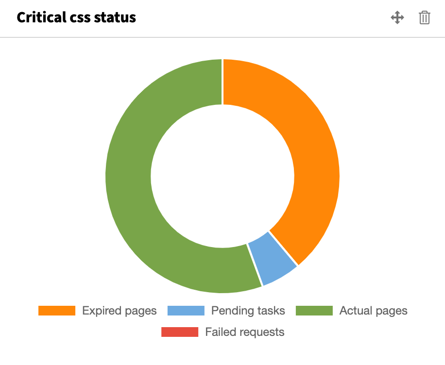

# CRITICAL CSS 🚀

This extension creates the "critical css" dynamically for each page.
Styles which have been integrated via PageRenderer or simple TypoScript are then automatically moved down from `head` to the end of the DOM.

Based on [penthouse](https://github.com/pocketjoso/penthouse/tree/master), a server running a service calls the single pages, determines the critical css and sends them back to TYPO3.
If you change or move any content element, or update the page properties, the critical css will be flushed on this page and automatically recalculated.

## Installation and setup

1. Get this extension via `composer req zeroseven/z7-critical-css`
2. Login to the [admin panel](http://64.225.109.175:8055/admin/collections/) and generate a token.
3. Store the authentication token via the extension configuration in TYPO3 settings module.

## Monitoring

A dashboard widget always gives you a good overview of how many pages are pending or expired, or just up-to-date.

## The record based detail pages problem (also called TRBDPP)

The critical css is stored in the database for each TYPO3 page.
Unfortunately, extensions like the good old "news" extension, for example, offers one page for many records.
For such "detail" pages you have to deactivate the service manually using the nicely styled button inside the page properties in the backend.

## TODO's:

* Create a Wikipedia article for "TRBDPP". LOL
