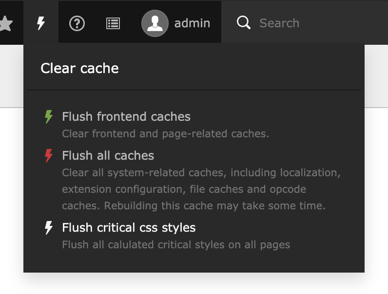

# CRITICAL CSS 🚀

This extension creates the "critical css" dynamically for each page.
Styles which have been integrated via PageRenderer or simple TypoScript are then automatically moved down from `head` to the end of the DOM.

Based on [penthouse](https://github.com/pocketjoso/penthouse/tree/master), a server running a service calls the single pages, determines the critical css and sends them back to TYPO3.
If you change or move any content element, or update the page properties, the critical css will be flushed on this page and automatically recalculated.

## Installation and setup

1. Get this extension via `composer req zeroseven/critical-css`
2. Login to the [admin panel](https://ccss.zeroseven.de/admin/collections/) and generate a token.
3. Store the authentication token via the extension configuration in TYPO3 settings module.

## Flush critical css

If you need to recalculate the critical css on all pages, for example because you updated the page template, you can do this with just a single click:



There are good reasons why "no admins" in TYPO3 shouldn't have this cache button. If they insist on needing it (they don't) then you can set the following option (you won't) in TSconfig:

```
options.clearCache.criticalCss = 1
```

### Flush command:

This function can also be called via a TYPO3 command:

```
vendor/bin/typo3 critical_css:flush
```

## Monitoring

A dashboard widget always gives you a good overview of how many pages are pending or expired, or just up-to-date.


## Disable on some pages

The service calls the respective sites without POST or GET parameters or even without cookies or anything similar.
Therefore it could make sense to deactivate the service for certain pages.
In the backend, there's an extra button in the page properties for that.

### 1. Post or get parameters

For pages with content that mostly behaves dynamic, the service should be disabled.
Let's take a search result page for example. The service will call this page without any search results, therefore making it impossible to consider the CSS of search results.
This leaves the user with incomplete styling in the `head` area.

### 2. The record based detail pages problem (also called TRBDPP)

The critical css is stored in the database for each TYPO3 page.
Unfortunately, extensions like the good old "news" extension, for example, offers one page for many records.
For such "detail" pages you have to deactivate the service manually using the nicely styled button inside the page properties in the backend.

## TODO's:

* Create a Wikipedia article for "TRBDPP". LOL
